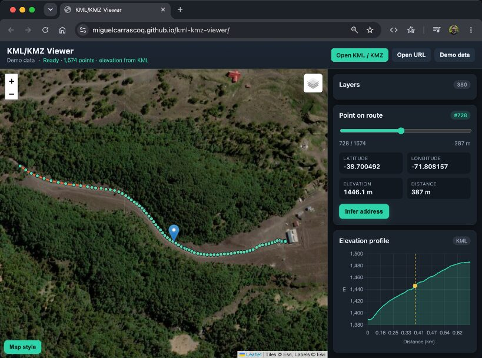

# KML/KMZ Viewer

Web-based KML and KMZ route viewer for desktop and mobile. Works on **GitHub Pages** with no paid map API keys.

Built with **TypeScript + Vite** (no UI framework). Leaflet and Chart.js stay imperative for the map and elevation profile.



## Features

- Load `.kml` or `.kmz` files (or the included sample)
- Remote load via **Open URL** or GET parameter `?url=` (public KML/KMZ with CORS)
- **Layers** tree when the file has folders / multiple placemarks (toggle, zoom, KML line colors)
- Placemark **icons** (`IconStyle`) and **GroundOverlay** images (including assets inside KMZ)
- Map layers: **Road**, **Satellite**, and **Hybrid** (OpenStreetMap + Esri)
- Slider to scrub through each point on the route
- Popup / panel with latitude, longitude, elevation, and cumulative distance
- **Infer address** button (free reverse geocoding: Nominatim OSM → Photon → BigDataCloud; Nominatim ~1 req/s)
- Elevation profile (Chart.js). If the file has no altitudes, they are fetched from [Open-Meteo Elevation](https://open-meteo.com/en/docs/elevation-api) (no API key)

## Included sample

| File | Description |
|------|-------------|
| `public/data/VID_20251121_030905_00_005.kml` | Demo data (loaded by default) |

You can also open any local `.kml` or `.kmz` with **Open KML / KMZ**.

## Load by URL

Pass a public KML or KMZ in the `url` parameter (must be URL-encoded):

```
https://miguelcarrascoq.github.io/kml-kmz-viewer/?url=https%3A%2F%2Fraw.githubusercontent.com%2Fmiguelcarrascoq%2Fkml-kmz-viewer%2Fmain%2Fpublic%2Fdata%2FVID_20251121_030905_00_005.kml
```

The host must allow CORS (`Access-Control-Allow-Origin`). Public Google Drive links are converted to a direct-download URL when possible, but Drive often blocks `fetch` from the browser.

If the host does not allow CORS, download the `.kml` / `.kmz` yourself (the app shows an **Open / download file** link on failure) and load it with **Open KML / KMZ**.

## Local usage

```bash
npm install
npm run dev
```

Open the URL printed by Vite (usually http://localhost:5173/kml-kmz-viewer/).

```bash
npm run build    # typecheck + production build → dist/
npm run preview  # serve dist locally
npm run typecheck
```

## GitHub Pages

Published at: https://miguelcarrascoq.github.io/kml-kmz-viewer/

CI builds with Vite and deploys `dist/` via [`.github/workflows/deploy.yml`](.github/workflows/deploy.yml). In the repo **Settings → Pages**, set the source to **GitHub Actions** (not “Deploy from a branch”).

## Project layout

```
src/
  main.ts        # app orchestration (map, UI, loaders)
  kml.ts         # KML parse (paths, folders, styles, points, overlays)
  kmz.ts         # KMZ unzip + resolve embedded icon/overlay hrefs
  elevation.ts   # Open-Meteo + Chart.js profile
  geocode.ts     # reverse geocoding providers
  types.ts       # Track / TrackPoint contracts
  styles.css
public/data/     # static KML samples
```
